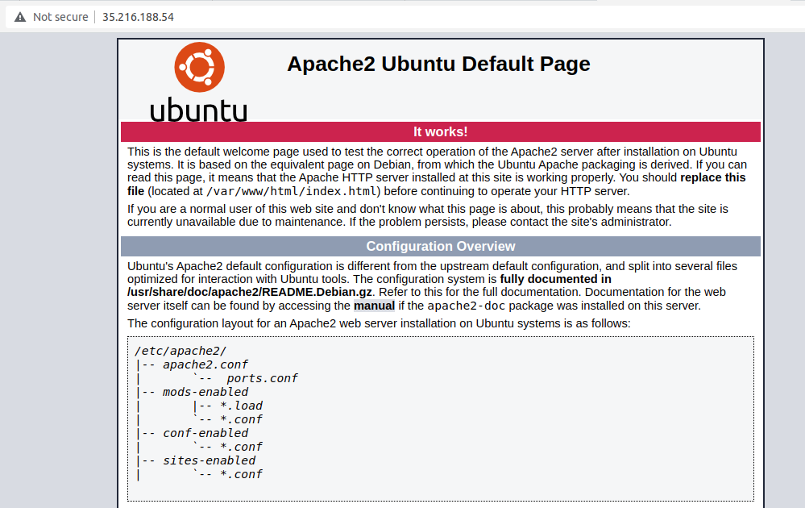

# Laboratorio: Aplicaciones cifrado

## Requisitos previos

- Máquina GNU/Linux: portátil, máquina virtual, o PC laboratorio (Entrar con credencial LDAP).
- Editor de código. En Visual Studio Code, pulsando ctrl+mayus+v renderiza este archivo de manera amigable (Sobre todo para imágenes).
- Herramientas necesarias: OpenSSL (`sudo apt install openssl`), Apache (`sudo apt-get install apache2`).
- Repositorio GitHub de asignatura: puedes subir los programas desarrollados en el laboratorio.

## Instalación de Apache

Para crear un sitio web seguro primero hay que instalar un servidor web en nuestro servidor de Google Cloud, en este caso Apache. Para hacerlo, abre una conexión SSH al servidor y ejecuta:


```bash
sudo apt-get install apache2
```

Si visitas la IP de la máquina con el navegador, por ejemplo `http://35.216.188.54`, debería aparecer la página por defecto de Apache. El navegador mostrará que la conexión no es segura, por ejemplo, mediante el mensaje “Not secure”.

## **Pasos**

1- Hacemos lo de ssh usuario@xx.xxx.xxx.xx
2- Dentro del ubuntu del servidor: sudo apt-get install apache2
3- Abrimos la IP externa, la de antes, si da error es por que hay que configurar el firewall
4- Para configurar firewall, ir a Firewall en Google Cloud  y activar las default-allow-http y https
5- IMPORTANTE: Para abrir la IP externa no vale pinchar desde el link de cloud por que es https y no va. Tiene que ser poner algo como http://34.175.153.32/ y entonces sale lo de Apache2 Default page-



## Creación de un sitio seguro

Si queremos que las conexiones al sitio web que acabamos de crear sean seguras, usando el protocolo HTTPS en vez de HTTP, debemos usar un certificado de servidor autofirmado y redirigir el tráfico del puerto 80 al puerto 443.

Para ello, en vez de usar la configuración por defecto de Apache, crea un `VirtualHost` que sólo contenga una página web llamada `index.html`, con el siguiente contenido:

```html
<h1>Conexión SSL</h1>
```

Genera un certificado autofirmado con OpenSSL y crea una configuración nueva de Apache con la redirección del puerto 80 al puerto 443.

Al visitar la web mediante HTTPS, aunque tenga un certificado, seguirá apareciendo un mensaje de error. Exporta el certificado y añádelo a tu navegador para que deje de mostrar ese aviso.

### Pasos :

#### 1. Crear el directorio para el sitio web
Apache viene con un sitio por defecto en /var/www/html/
Al crear /var/www/ssl-site, tienes un sitio independiente solo para SSL

```bash
sudo mkdir -p /var/www/ssl-site
```

#### 2. Crear el archivo index.html
```bash
sudo nano /var/www/ssl-site/index.html
```
```html
<h1>Conexión SSL</h1>
```

#### 3. Generar certificado SSL autofirmado
```bash
sudo openssl req -x509 -nodes -days 365 -newkey rsa:2048 \
    -keyout /etc/ssl/private/apache-selfsigned.key \
    -out /etc/ssl/certs/apache-selfsigned.crt
```

#### 4. Habilitar el módulo SSL de Apache y permitir redirección a https
```bash
sudo a2enmod ssl
sudo a2enmod rewrite
```

#### 5. Crear configuración VirtualHost para SSL
```bash
sudo nano /etc/apache2/sites-available/ssl-site.conf
```
Añadir la siguiente configuración:
```apache
<VirtualHost *:80>
    ServerName IP_EXTERNA
    DocumentRoot /var/www/ssl-site
    Redirect permanent / https://IP_EXTERNA/
</VirtualHost>

<VirtualHost *:443>
    ServerName IP_EXTERNA
    DocumentRoot /var/www/ssl-site
    
    SSLEngine on
    SSLCertificateFile /etc/ssl/certs/apache-selfsigned.crt
    SSLCertificateKeyFile /etc/ssl/private/apache-selfsigned.key
    
    <Directory /var/www/ssl-site>
        AllowOverride All
        Require all granted
    </Directory>
</VirtualHost>
```
**IP_EXTERNA**: Reemplaza `IP_EXTERNA` con tu IP real

#### 6. Deshabilitar el sitio por defecto y habilitar el nuevo
```bash
sudo a2dissite 000-default
sudo a2ensite ssl-site
```

#### 7. Verificar configuración y reiniciar Apache
```bash
sudo apache2ctl configtest
sudo systemctl reload apache2
```

#### 8. Probar la configuración
- Visita `http://tu-ip-externa` → debería redirigir automáticamente a HTTPS
- Visita `https://tu-ip-externa` → debería mostrar "Conexión SSL" con advertencia de certificado

#### 9. Exportar y añadir certificado al navegador
Para eliminar la advertencia del navegador:

**Exportar certificado:**
```bash
sudo cp /etc/ssl/certs/apache-selfsigned.crt ~/certificado.crt
```
# Este archivo se genera en el servidor, no en el pc así que copiamos contenido y lo guardamos en nuestro ordenador.
cat ~/certificado.crt

**En el navegador: ESTE ULTIMO PASO NO HE CONSEGUIDO, ME DA ERROR**
- Chrome: Configuración → Privacidad y seguridad → Seguridad → Administrar certificados → Autoridades → Importar

**Solución de problemas:**
- Si Apache no reinicia: `sudo systemctl status apache2` para ver errores
- Si no redirige: verificar que el módulo rewrite esté habilitado
- Si HTTPS no funciona: comprobar que el puerto 443 esté abierto en el firewall
