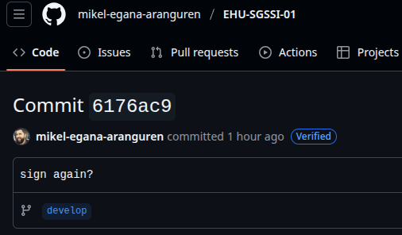

# Laboratorio: Cifrado asimétrico

## Requisitos previos

- Máquina GNU/Linux: portátil, máquina virtual, o PC laboratorio (Entrar con credencial LDAP).
- Editor de código. En Visual Studio Code, pulsando ctrl+mayus+v renderiza este archivo de manera amigable (Sobre todo para imágenes).
- Herramientas necesarias: OpenSSL (`sudo apt install openssl`), gpg (`sudo apt install gpg`).
- Repositorio GitHub de asignatura: puedes subir los programas desarrollados en el laboratorio.

## Generar claves GPG

[GnuPG (GPG)](https://gnupg.org/) es un programa libre que nos permite cifrar, descifrar y firmar información cumpliendo el estándar [OpenPGP](https://www.openpgp.org/) y así asegurar nuestras comunicaciones. GPG ofrece muchas posibilidades. Es conveniente familiarizarse con ellas:

```bash
gpg --help
```

Para trabajar con GPG, lo primero es generar un par de claves (Pública y privada):

```bash
gpg --generate-key
```

Es muy importante proveer una dirección de email válida. La frase clave es opcional y sirve para proteger el acceso al llavero de claves privadas. En PGP, el llavero es el almacén donde se almacenan las claves con las que se va a trabajar. Existe un llavero de claves privadas, y otro llavero de claves públicas. Es aconsejable proteger el llavero con una frase clave.

Usando el comando `gpg --full-generate-key` se puede especificar qué longitud de clave deseáis usar, y qué algoritmo queréis usar para su creación. GnuPG soporta RSA, DSA y ElGamal. Para la creación del par de claves se usa una medida denominada entropía, que simboliza la cantidad de aleatoriedad o desorden que tiene la clave. A mayor entropía, mayor aleatoriedad y por lo tanto más complicado de realizar un criptoanálisis. En la generación de claves la entropía se obtiene en base a datos de la máquina como el estado de la CPU, la fecha, el número de ventanas abiertas, etc. Así que mientras se genera la clave es aconsejable navegar, abrir ventanas, teclear cosas, etc. para generar una entropía lo mayor posible.

Una vez terminada la generación de las claves se da la posibilidad de crear un certificado de revocación de las claves. El certificado de revocación sirve para indicar que tu clave ya no es válida porque la has perdido, te la han robado, etc. Cread el certificado de revocación y guardadlo.

Una vez creadas las claves, para verlas:

```bash
gpg --list-keys
```

> ¿Qué quiere decir `[ultimate]`?

Es importante que la clave pública esté accesible. Se puede publicar en una página [web personal](https://mikel-egana-aranguren.github.io/contact/), se puede enviar adjunta en un email, o se puede publicar en servidores específicos como **keys.openpgp.org** (Ver más adelante).

Para enviar archivos que han sido cifrados en la línea de comandos mediante GPG simplemente basta con adjuntarlos en el email.

- Cifrad este archivo y enviároslo entre vosotros de forma que consigáis los principios de **Confidencialidad**, **Integridad**, **Autenticidad** y **No Repudio**.

### Proceso para conseguir los principios de seguridad

Para conseguir los cuatro principios fundamentales, el proceso sería:

#### **Confidencialidad** (Solo el destinatario puede leer el mensaje, ciframos con llave pública del otro)
```bash
# Cifrar el archivo con la clave pública del destinatario
gpg --encrypt --recipient nombre@email.com archivo.txt
```

- **Qué hace**: Cifra el archivo usando la clave pública del destinatario
- **Resultado**: Solo quien tenga la clave privada correspondiente puede descifrarlo
-GPG busca en su anillo de claves la clave pública asociada al email
- **Prerequisito**: La clave pública del destinatario debe estar previamente importada:
  ```bash
  # Importar la clave pública del destinatario
  gpg --import clave_publica_destinatario.asc
  # O buscarla en un servidor de claves
  gpg --search-keys nombre@email.com
  ```

#### **Integridad** y **Autenticidad** y **No Repudio** (El mensaje no se ha modificado y proviene del remitente)
```bash
# Firmar el archivo con nuestra clave privada
gpg --sign archivo.txt
```
- **Qué hace**: Crea una firma digital usando nuestra clave privada
- **Resultado**: Demuestra que el archivo proviene de nosotros y no ha sido modificado


#### ** TODO A LA VEZ: Proceso completo** (Todos los principios a la vez)
```bash
# Cifrar Y firmar en una sola operación
gpg --encrypt --sign --recipient destinatario@email.com archivo.txt
```

**Flujo completo:**
1. **Emisor**: Firma con su clave privada (autenticidad + no repudio)
2. **Emisor**: Cifra con la clave pública del destinatario (confidencialidad)
3. **Destinatario**: Descifra con su clave privada
4. **Destinatario**: Verifica la firma con la clave pública del emisor (integridad)

> Razonad qué habéis tenido que hacer para conseguir cada uno de ellos.


## Confianza sobre las claves GPG

Como habéis podido comprobar, es muy fácil crear un par de claves y poner cualquier nombre. No se realiza ningún tipo de comprobación. Por lo que si recibimos un archivo firmado y/o cifrado por una persona, no podemos estar seguros de que realmente sea esa persona a no ser que tengamos alguna manera de preguntarle si esa es realmente su clave. Sin embargo, existen mecanismos para que podamos confiar en las claves de una persona aun sin necesidad de conocerla o haber hablado previamente con ella para comprobar si esa es su clave.

- En cada grupo se designará a uno de los estudiantes como “de confianza”, es decir el profesor tendrá confianza plena en esa persona. Ese estudiante enviará su clave pública al profesor. El grupo tendrá que conseguir que al enviar las claves públicas de los otros estudiantes al profesor aparezcan como de confianza (`[full]`) en el **anillo de claves del ordenador del profesor**.

> Razonad qué habéis tenido que hacer para conseguirlo.

### Proceso para establecer la cadena de confianza

#### **Web of Trust**
El sistema de confianza de GPG se basa en firmas cruzadas entre usuarios. Si confío en persona A, y persona A firma la clave de persona B, entonces puedo confiar transitivamente en B.

#### **Pasos:**

##### 1. **Establecer el nodo raíz de confianza**
```bash
gpg --edit-key estudianteconfianza@email.com
# En el prompt de GPG: trust → 5 (ultimate) → quit
```

##### 2. **El estudiante de confianza firma las claves de sus compañeros**
```bash
# El estudiante de confianza importa y firma cada clave de compañero
gpg --import clave_companero.asc
gpg --sign-key companero@email.com
gpg --export companero@email.com > companero_firmada.asc 
```

##### 3. **Envío de claves firmadas al profesor**
- Los estudiantes envían sus claves ya firmadas por el estudiante de confianza.

##### 4. **Verificación en el anillo del profesor**
```bash
# El profesor importa las claves firmadas
gpg --import *.asc
# Verifica el nivel de confianza
gpg --list-keys --with-colons | grep -E "(pub|uid)"
```


## Anillos públicos de claves GPG

Lo más sencillo para publicar y buscar claves es usar un servicio como [Keys OpenPGP](https://keys.openpgp.org/). Para usarlo hay que añadir la siguiente linea al archivo `/home/{usuario}/.gnupg/gpg.conf`:

```bash
keyserver hkps://keys.openpgp.org
```

- 1-Configura GPG para que funcione con keys.openpgp.org desde la terminal.
    Si  no aparece el archivo gpg.conf hay que crearlo tal cual con nano.
  # Añadir servidor de claves al archivo de configuración
  *Establece keys.openpgp.org como servidor predeterminado para buscar/subir claves*

- 2-Sube tu clave al servidor usando GPG en la terminal.
    haciendo   gpg --list-keys se ve la KEY_ID
  ```bash
  gpg --send-keys TU_KEY_ID
  ```
  *Publica tu clave pública para que otros puedan encontrarla y descargarla*
    Sale algo como: "gpg: enviando clave 4F19907579DEAE34 a hkps://keys.openpgp.org"

- 3-Busca las claves de los otros estudiantes y la del profesor usando GPG en la terminal.
  ```bash
  # Buscar claves por email
  gpg --search-keys mikel.egana@ehu.eus
  # Para comprobar que la tenemos
  gpg --list-keys mikel.egana@ehu.eus
  ```

- 4-Recrea el ejercicio de la sección anterior, Confianza sobre las claves, pero esta vez usa el servidor de claves a través de la terminal en vez de enviar las claves al profesor:

  En lugar del intercambio manual de archivos, todos los estudiantes suben sus claves públicas al servidor keys.openpgp.org usando `gpg --send-keys`. El estudiante de confianza descarga las claves de sus compañeros desde el servidor con `gpg --search-keys`, las firma localmente, y las vuelve a subir al servidor con las firmas incluidas (`gpg --send-keys`). Finalmente, el profesor descarga todas las claves (que ya contienen las firmas de confianza) directamente del servidor, marca al estudiante de confianza como "ultimate", y automáticamente todas las claves firmadas aparecen como de confianza total debido a la transitividad del sistema. E

## Anillo de claves GPG de la clase SGSSI

Vamos a recrear el anillo de claves de la sección anterior, pero sólo con las claves de los estudiantes de clase y usando eGela. Para ello, el profesor definirá una cadena de confianza designando a ciertos estudiantes, y el resto de estudiantes subirán sus claves públicas asegurando la confianza de manera transitiva (Empezando en los estudiantes de confianza). El profesor comprobará la confianza de la cadena importando todas las claves, pero dándole confianza sólo a la primera (Al importarlas, todas deberían aparecer como de confianza en el ordenador del profesor).

Sería lo mismo que antes

## Firmas GPG

En la página web de los desarrolladores de [Enigmail](http://www.enigmail.net/download) se pueden descargar dos ficheros, la extensión para Thunderbird (`.xpi`) y otro fichero llamado “GPG Signature”.

> ¿Para qué sirve ese segundo fichero?¿Cómo se usa?
El archivo "GPG Signature" es una **firma digital separada** del archivo principal (.xpi). Su propósito es:
- **Verificar la integridad**: Garantiza que el archivo .xpi no ha sido modificado
- **Autenticidad**: Confirma que el archivo proviene realmente de los desarrolladores de Enigmail
- **Seguridad**: Protege contra malware o versiones comprometidas

#### **Cómo se usa:**
```bash
# 1. Descargar ambos archivos: enigmail.xpi y enigmail.xpi.asc
# 2. Importar la clave pública de los desarrolladores
gpg --search-keys desarrolladores@enigmail.net

# 3. Verificar la firma
gpg --verify enigmail.xpi.asc enigmail.xpi
```
Así veremos que el archivo es el auténtico.


En GitHub existe la opción de firmar commits mediante GPG, para aumentar la seguridad y trazabilidad de dichos commits. El profesor ha firmado el commit con el Hash `6176ac9c479797c698b153c7750fa3e4421f445d` de la rama `develop` del repositorio de apuntes de la asignatura [EHU-SGSSI-01](https://github.com/mikel-egana-aranguren/EHU-SGSSI-01), con la clave privada generada a la vez que la siguiente clave pública (`mikel.egana.aranguren@gmail.com`):

```
-----BEGIN PGP PUBLIC KEY BLOCK-----
mDMEaMlpKBYJKwYBBAHaRw8BAQdA9BUe340yfVTGvu5htYNgujz5pGtx6GfIRP8h
CALZ+im0OE1pa2VsIEVnYcOxYSBBcmFuZ3VyZW4gPG1pa2VsLmVnYW5hLmFyYW5n
dXJlbkBnbWFpbC5jb20+iJkEExYKAEEWIQQYFaxDxNCAFSKkZypj4GjUA79N7wUC
aMlpKAIbAwUJBaOagAULCQgHAgIiAgYVCgkICwIEFgIDAQIeBwIXgAAKCRBj4GjU
A79N75+fAQD75ya26vOiPsP18zWcclNbEqbt4f/260ycrRYsAoeNAgD/Wsa8GlSP
DnG2X1SC2GY8/X0rfcavzE3Ib4gJzoOkSQe4OARoyWkoEgorBgEEAZdVAQUBAQdA
4zlL3S3rbtPiUuPBscGteaVhYCRjmVuph+0KE/FUQUoDAQgHiH4EGBYKACYWIQQY
FaxDxNCAFSKkZypj4GjUA79N7wUCaMlpKAIbDAUJBaOagAAKCRBj4GjUA79N71q2
AP0W791v7y2QBsaxNuWlZqW/CNHamHJz1hr7tCWs/Jfa2wD9Gh1rszwCy6zXCNOv
hqLrPTy2euh/O45VyZSigvW+QgM=
=aYb8
-----END PGP PUBLIC KEY BLOCK-----
```

El commit aparece como verificado en GitHub (“Verified”). ¿Esto qué quiere decir?



> Verifica ese mismo commit en tu ordenador local. ¿Qué pasos tienes que seguir?

### Pasos para verificar el commit firmado localmente:

#### 1. Moverse a rama develop, desde la carpeta del repo
```bash
git checkout develop
```

#### 2. Importar la clave pública del profesor
```bash
# Crear archivo con la clave pública (copiar del bloque anterior), ponerle la clave publica
nano profesor_key.asc
# Importar la clave
gpg --import profesor_key.asc
```

#### 3. Verificar la firma del commit
```bash
# Verificar commit específico
git verify-commit 6176ac9c479797c698b153c7750fa3e4421f445d
```
Sale que sí es correcta.

> Usa tus claves GPG para firmar un commit en el repositorio GitHub de la asignatura, de modo que aparezca como “Verified” al verlo en GitHub. Verifica los commits firmados por otros estudiantes.

### Pasos para firmar commits y que aparezcan verificados en GitHub:

#### **1. Configurar Git con tu clave GPG**
```bash
# Obtener el ID de tu clave
gpg --list-keys 

# Configurar Git para usar tu clave GPG
git config --global user.signingkey TU_KEY_ID
git config --global commit.gpgsign true
```

#### **2. Subir tu clave pública a GitHub**
```bash
# Exportar tu clave pública
gpg --armor --export tu@email.com

# Copiar la salida y añadirla en GitHub:
# Settings → SSH and GPG keys → New GPG key
```

#### **3. Hacer commits firmados**
```bash
git add .
# Commit automáticamente firmado (si tienes commit.gpgsign = true)
git commit -m "Mi commit firmado"

# O firmar manualmente un commit específico
git commit -S -m "Mi commit firmado"

# Push al repositorio
git push
```

#### **ESTO NO HE COMPROBADO 4. Verificar commits de otros estudiantes localmente**
```bash
# Ver log con información de firmas
git log --show-signature

# Verificar commit específico de otro estudiante
git verify-commit HASH_DEL_COMMIT

# Importar clave del estudiante si es necesario
gpg --search-keys email@estudiante.com
```

**Resultado**: Los commits aparecerán con badge "Verified" en GitHub y se podrán verificar localmente.

## Otras funcionalidades GPG

Es importante que seáis capaces de usar vuestras claves en otros equipos, sobre todo de cara al examen.

> ¿Cómo se exporta una clave GPG para poder usarla en otro equipo?

Puede pasar que una clave quede comprometida.

> ¿Cómo revocarías tu clave?

Aunque su función principal es el cifrado asimétrico, GPG también se puede usar para cifrado simétrico.

> ¿Como cifrarías este documento de manera simétrica, y qué pasos seguirías para que el receptor lo descifre?

## RSA

Genera un par de claves RSA con OpenSSL:

```bash
openssl genpkey -algorithm RSA -out clave.pem
```
El archivo `clave.pem` tiene ambas claves, para poder ver su estructura interna: 

```bash
openssl rsa -text -in clave.pem
```

Para extraer la clave pública:

```bash
openssl rsa -pubout -in clave.pem -out clave_publica.pem
```

Encripta un mensaje con la clave publica mediante `openssl pkeyutl -encrypt`. Descífralo con la clave privada y comprueba que el mensaje coincide. 

> RSA sirve para archivos pequeños. ¿Cómo implementarías un cifrado híbrido, usando AES para cifrar el archivo de manera simétrica y RSA para cifrar la clave AES? 
